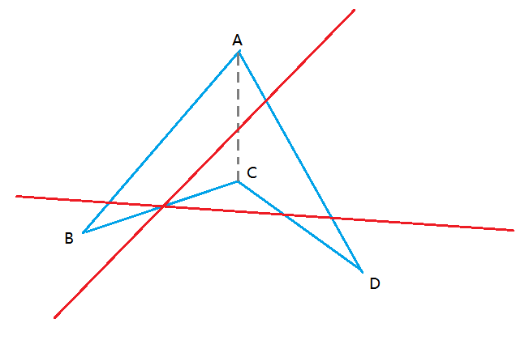

Interview
====

### 分组任务顺序与并发执行问题  

参考代码文件注释 [ExampleUnitTest.java](./ExampleUnitTest.java)

### 四点四象限问题

对于随机的四个点，画两条线，正好使得四个点分别位于四个象限之内

实现逻辑：  
需要区分是否为凹四边形
1. 如果是凹四边形，则通过位于大的三角形内部的点，分别连接三角形三个顶点，取连线的中点连接

2. 如果说凸四边形，两两连线后排除连线交叉的情况，然后取中点进行连接

这里实现的逻辑有点傻瓜式，没有找到更优雅的实现方式

