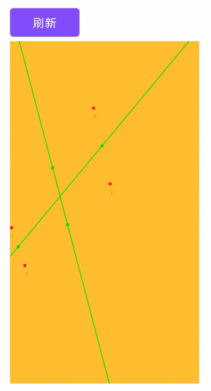

Interview
====

### 分组任务顺序与并发执行问题  

A、B、C 三组任务，每组任务有三个子任务，要求：
1. 每组任务并发执行，组内任务依次执行
2. 组内任务并发执行，组间同次序任务依次执行
3. 每一组任务顺序执行，但是所有组的同次序任务执行完成之后，才能执行下一个次序的任务
4. 组内任务并发执行，组间依次执行，要求 A 组内 3 个都执行完，再执行 B 组，B 组都执行完再执行 C 组

参考代码文件注释 [ExampleUnitTest.java](./ExampleUnitTest.java)，主要是关于Java同步工具类的使用

### 四点四象限问题

对于随机的四个点，画两条线，正好使得四个点分别位于四个象限之内

实现逻辑：  
需要区分是否为凹四边形
1. 如果是凹四边形，则通过位于大的三角形内部的点，分别连接三角形三个顶点，取连线的中点连接

2. 如果是凸四边形，两两连线后排除连线交叉的情况，然后取中点进行连接

实现代码：[FourPointView.java](./FourPointView.java)  

实现效果：  

